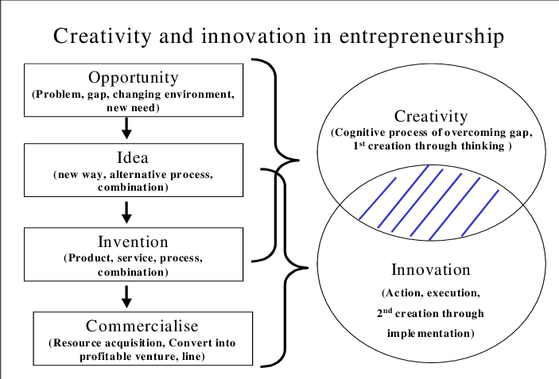

Atlassian senior manager attended our lecture

- Innovation
- Creativity
- Innovation in organisations
- Innovation theories 

## Guest 
Elizabeth Si - seemed very close to the lecturer
Account management team strategic customer

HQ still in NSW, new building finishing up

## Assessments

1. 21st March 11.59pm 30% Idea generation and evaluation technique (1400~2200 words)

2. 16th May 11.59pm 50% (Individual 40% Group 10%) Innovation Concept Development

3. Week 12 Classroom 20% Group Presentation

## Innovation?

Prof: 
- bringing a new value to the end-users
- changing to create to make better things for end-users

Dictionary: 
- Process which through which <b>new</b> products, concepts, services, methods, or techniques are developed.

Meaning seems to be changing, but market leaders across the field are eager for new ideas to foster discovery, 
creativity and collaboration

Entities: Employees, Companies, Products/Services, Customers

Disciplines: Psych, Business, Economics, Psych

"if you're happy, you create a good result, which gets you marks"

### Innovation cycles

almost like playing a game of Factorio

## Creativity 

Dictionary: 
- the ability to produce or use original and unusual ideas

### Creativity vs Innovation

Difference between the terms

Creativity is the process of generating new ideas while
Innovation is the process of putting those ideas into practice

## Creative Thinking

Top 10 idea-friendly time: "while at work isn't there!"

## Divergent & Convergent Thinking

### Divergent
- coming up with new ideas (making list)

### Convergent
- choosing one and implementing (making choices)

Organisations over utilise convergent and under utilise divergent thinking
(boss saying it won't work to an employee with a new idea)

Fear of failure often discourages divergent thinking

## TRIZ
Theory of Inventive Problem Solving

based on the idea that there are universal principles of innovation and problem-solving that can be applied to any field
or industry.

## de Bono's Six Thinking Hat

## Kodak 

Pioneer of digital cameras, but now its in everyone's phone, devices.

### Innovation and Significant contribution

Significant contribution is the result of thinking outside the box - considering a situation from alternative points of view.

### Organisational Climate
1. Challenge - what degree are people challenged & emotionally involved by the work
2. Freedom - to what degree are people to decide how to do their jobs
3. Idea time - do people have time to think through before taking actions
4. Dynamism and Liveliness - how lively is the organisation
5. Support for ideas - ideas / suggestions received in an attentive way, constructive atmosphere
6. Trust and Openness - emotional safety in relationships, open communication
7. Playfulness and Humour 
8. Conflicts - to what degree do people engage in interpersonal or personal or emotional tensions
9. Debates - to what degree do people engage in lively debates about the issue
10. Risk taking - Tolerance of uncertainty and ambiguity

### 5 pitfalls
- working on the wrong problem
- Judging ideas too quickly, giving idea no chance
- Stopping with the first idea.
- Obeying rules that don't exist or outdated
- Failing to get sponsership and build coalitions

### Power of Autonomy 

### Collboration 

## Innovation Theory

### S- Curve
formation and growth of innovations

### Dominant Design

### Gartner Hype Cycle
Investment also is related to it, industry would see where the world is about what they want to invest.

WazokuCrowd - Innovation Crowd 
