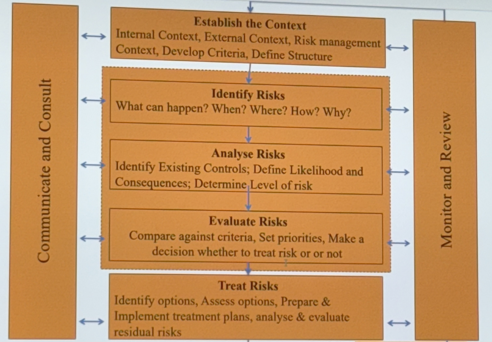

## Free float

ES (of successor) - EF (of current activity)

## Total float

LS - ES or LF - EF

## Risks
possibility of something that can occur that affect your project negatively

involves uncertainty about the effects/implications of an activity. but it can also be positive (opportunity)

## Opportunity
something unplanned could exploit to have a positive impact on your project.

### Known
Expected 

### Unknown
Unexpected

## What is risk management

structured approach to go looking for uncertainties and their effect on objectives

coordinated activities to direct and control an organisation with regard to risk

## Why manage risk

CAUSE - RISK EVENT - EFFECT
=> COST, TIME, SCOPE, QUALITY

Increase probability & impact of positive events

Decrease probability and impact of negative events

### Risk management plan

identify risk,
go through all possible, 
why its significant, what is to be done to reduce/increase it?,
when will the risk have its impact in the project
who is responsible for resolving, how the reduction/increase will be achieved, how much cost it will take to resolve.

Risks are monitored against the plan as a part of the routine control of the project.

PSR ( project status report) on monthly basis, high critical risks, report to senior manager and they'll get understand what needs to be done going forward.

### Risk management process

#### Communicate and Consult : 

exchange idea, info between stakeholders,
objectives, improve understanding, awareness of roles & responsibilities and trust. 

#### Establish context 

External:
SWOT, key business drivers

Internal:
culture, objectives, stakeholders, structure, capabilities of resources, goals

Risk management context:
determine scope of what RM exercise applies to, depth and breath, decide
on relationships between

Establish risk criteria:
define likelihood, infidelity and measure causes and consequences,
how level of risk is determined
level where risks become acceptable 
what criteria to use. - maybe affected by perceptions of stakeholders

Define structure: 
ensure significant risks are not overlooked, separating activity, function , process in to elements that provide framework for identification and analysis (use wbs as starting point)

#### Risk assessment 

Risk identification:
identify what the risk events are, identify source, areas of impact, cascading or cumulative effects, generate list, get everything, consider causes and scenarios

tools for identification >  
checklists, records, experience, brainstorming, expert advice (SME), systems analysis, modelling.

(risk grouping) :physical, financial, legal, moral/ethical  
(risk grouping 2): WBS of risks (technical, external, organisation, project management)  
(risk grouping 3): Partial risk profile for product development project (on every aspects)

Risk analysis: **important for assigenment**
Identify controls (factors affecting likelihood & consequences),
identify likelihood, check causes sources, identfiy consequence (+ -), identify level of risk

Types of analysis>
Qualitative : describing (when generally risk is low or quantitative is unavailable),
semi-quantitative,
Quantitative: numbers against it,
combination

table, graph, decide on when to use one another.

likelihood categories > have to define it.  
Almost certain, likely, possible, unlikely, rare 

consequence scale > have to define and example too  
insignificant, minor, moderate, major, catastrophic

Risk matrix 

Risk evaluation: 
